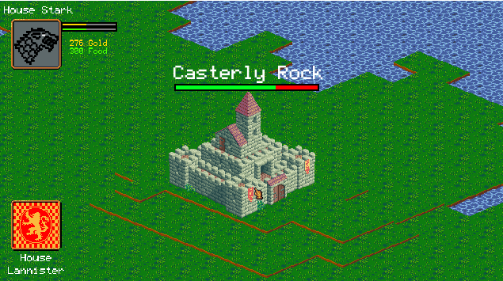

# Estate
- - - -
**Estate** is a 2D RTS Game done in C++.
*Allegro5* is used for Graphics and Audio.

## Installation

Clone this repository, and open the .sln file with Visual Studio. Development of this project was done in Visual Studio 2017.
Download Allegro5 using the nuGet package manager, or set it up manually through downloading it online. 
Add-ons that were used include the Font addon, Image addon and Audio addon, so enable those through Visual Studio or otherwise.

## License
[MIT](https://opensource.org/licenses/MIT)
