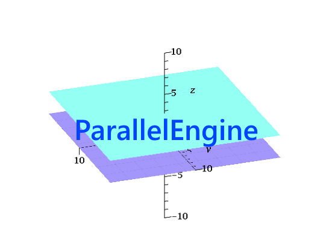

# parallel-engine 

- - - -
**parallel-engine** is a 2D Game Engine done in C++.
*Allegro5* is used for Graphics and Audio.

## Installation

Clone this repository, and open the .sln file with Visual Studio. Development of this project was done in Visual Studio 2017.
Download Allegro5 using the nuGet package manager, or set it up manually through downloading it online. 
Add-ons that were used include the Font addon, Image addon and Audio addon, so enable those through Visual Studio or otherwise.

## Usage / Features
This game engine is built for use in creating 2D games. The game engine has the following planned and complete features:
### 1. The Game State Stack 
 Game States are handled through the use of a stack, where the top is the current state, and subsequent states are pushed onto the stack.
### 2. Asset Loading and Management
 Hashmaps are used to store key-value pairs of assets for asset retrieval anywhere within the project. 
### 3. TileMap creation and Simple 2D Tile Collision Detection 
 TileMaps can be created with an external application included in the Engine, and then parsed in for use. TileMaps will consist of a graphics layer, which tells the program what to draw and collision layer, which tells the program where collisions should occur. 
### 4. 2D Sprite Animation  
 2D character spritesheets can be added into the project and connected to entities very easily to add anamiation into entities.
### 5. GLSL Shader Support
 Shaders done in GLSL can be added into the project and used to produce any graphic effects you desire.
### 6. Entity Collision and Movement
 Entities can easily be created through grouping up different Components, and seamlessly integrated into a level with collision to the TileMap.

## License
[MIT](https://opensource.org/licenses/MIT)
